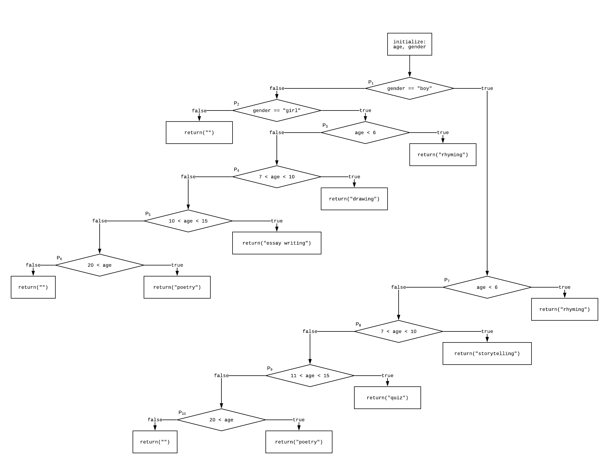

# Domain Testing

## Control Flow Graph

## Predicates

| #              | Predicate          |
| -------------- | ------------------ |
| P1  | `gender == "boy"`  |
| P2  | `gender == "girl"` |
| P3  | `age < 6`          |
| P4a | `7 < age`          |
| P4b | `age < 10`         |
| P5a | `10 < age`         |
| P5b | `age < 15`         |
| P6  | `20 < age`         |
| P7  | `age < 6`          |
| P8a | `7 < age`          |
| P8b | `age < 10`         |
| P9a | `11 < age`         |
| P9b | `age < 15`         |
| P10 | `20 < age`         |

## Domain Graph

